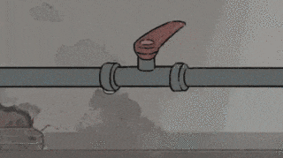
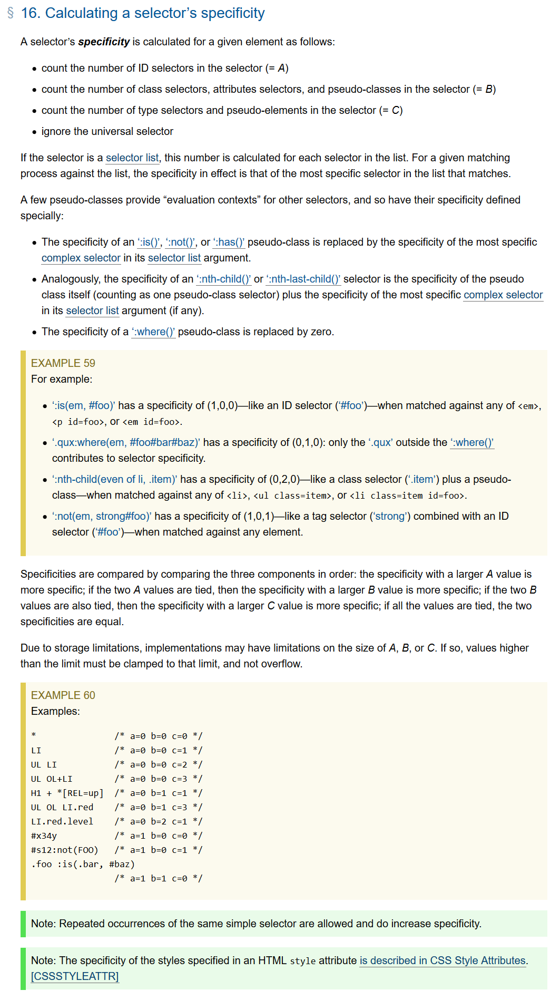

# css优先级

## 选择器类型

相信大部分人刚开始写 `css` 的时候应该碰到过这样的问题。

明明只改了一行样式，然后整个页面就变成了这样↓

本文将小节一下 `css` 的优先级，帮助解决碰到的样式重叠 优先度问题，这部分也是面试中常出现的考题。

要搞清楚选择器的优先级，先列举下所有选择器

**选择器类型**

1. ID 选择器，如 `#id`

2. 类选择器，如 `.class`

3. 属性选择器，如 `[type="input"]`

4. 伪类选择器，如 `:hover`

5. 标签选择器(类型选择器)，如 `div`

6. 伪元素选择器，如 `::before`

7. 通配选择符 `*{}` 、 关系选择符 `(+,>,~,' ',||)` 、 否定伪类 `(:not())`

> 摘自 `css 优先级|MDN` [https://developer.mozilla.org/zh-CN/docs/Web/CSS/Specificity](https://developer.mozilla.org/zh-CN/docs/Web/CSS/Specificity)

## 优先级

优先级按从高到低依次为：

1. `!important` 例外规则。当在一个样式声明中使用一个 `!important` 规则时，此声明将覆盖任何其他声明。

2. 内联样式

3. ID 选择器

4. 类选择器、属性选择器、伪类选择器

5. 类型选择器(标签选择器)、伪元素选择器

6. 通配选择符

## 计算方式

参考 W3C ：

[https://www.w3.org/TR/selectors/#specificity](https://www.w3.org/TR/selectors/#specificity)

翻译一下，就是把 `ID 选择器` 当作 **A** ，把 `类选择器、属性选择器、伪类选择器` 当作 **B** ，把 `类型选择器(标签选择器)、伪元素选择器` 当作 **C** 再计算。

如果选择器是一个选择器列表，则累加。

`*{}` 是通配选择符，表示 `(0,0,0)` 

`ul li{}` 有两个标签选择器，所以表示 `(0,0,2)` 

`ul ol+li` 有三个标签选择器，表示 `(0,0,3)` 

`ul ol li.red` 有三个标签选择器和一个类选择器，所以表示 `(0,1,3)` 

`:not(em, strong#foo)` 有一个ID 选择器和一个标签选择器，所以表示 `(1,0,1)` 

其他就不一一介绍了。。。

## 错误的说法

在学习过程中，你可能发现给选择器加权值的说法，即 ID 选择器权值为 100，类选择器权值为 10，标签选择器权值为 1，当一个选择器由多个 ID 选择器、类选择器或标签选择器组成时，则将所有权值相加，然后再比较权值。这种说法其实是有问题的。比如一个由 11 个类选择器组成的选择器和一个由 1 个 ID 选择器组成的选择器指向同一个标签，按理说 110 > 100，应该应用前者的样式，然而事实是应用后者的样式。错误的原因是： **选择器的权值不能进位**。还是拿刚刚的例子说明。11 个类选择器组成的选择器的总权值为 110，但因为 11 个均为类选择器，所以其实总权值最多不能超过 100， 你可以理解为 99.99，所以最终应用后者样式。
