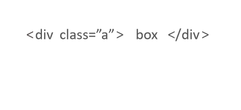

# 实现一个简易AST解析器

## 目标

我们希望将一份 `html` 

```html
<div class="box" style="color: red;">
  div层
  <span>span层</span>
</div>
```

转换成 `ast` 

```json
{
  "node": "root",
  "child": [{
    "node": "element",
    "tag": "div",
    "attrs": {
      "name": "style",
      "value": "color: red;"
    }
  }]
}
```

## 一些匹配正则表达式

### 1、匹配元素标签

```html
<div>box</div>
```

 `div` 是一个 `html` 标签， `html` 标签是字母、下划线开头，包含字母、数字、下划线、中划线、点号组成。

> 可参考： [https://www.w3.org/TR/1999/REC-xml-names-19990114/#NT-QName](https://www.w3.org/TR/1999/REC-xml-names-19990114/#NT-QName)

```js
var ncname = /[a-zA-Z_][\w-.]*/
```

### 2、匹配标签属性

 `html` 标签上的属性名称中常见的有如 `id` 、 `class` 、 `data-` ，也可以用户自定义。但属性名称也要遵循原则，通常是字母、下划线、冒号开头（如 `vue` 的属性 `:class` ），包含字母数字下划线中划线冒号和点

```js
var attribute = /[a-zA-Z_:][a-zA-Z0-9_-:.]*/
```

 `html` 的属性写法有以下几种：

1. class="box"
2. class='box'
3. class=box

```js
var attribute = /([a-zA-Z_:][-a-zA-Z0-9_:.]*)=("([^"]*)"|'([^']*)'|([^\s"'=<>`]+))/
```

测试下正则：

```js
'class="box"'.match(attribute)
// output
(6) ["class="box"", "class", ""box"", "box", undefined, undefined, index: 0, input: "class="box"", groups: undefined]

"class='box'".match(attribute)
// output
(6) ["class='box'", "class", "'box'", undefined, "box", undefined, index: 0, input: "class='box'", groups: undefined]

"class=box".match(attribute)
// output
(6) ["class=box", "class", "box", undefined, undefined, "box", index: 0, input: "class=box", groups: undefined]
```

我们发现，第一个和第二个匹配，匹配的结果是 `""box""` 、 `"'box'"` ，多个引号，需要用非匹配获取 `(?:)` 。并且 `attribute` 的 `=` 两边可能有空格也需要处理下。那么

```js
var attribute = /([a-zA-Z_:][-a-zA-Z0-9_:.]*)\s*=\s*(?:"([^"]*)"|'([^']*)'|([^\s"'=<>`]+))/
```

再测试下：

```js
'class="box"'.match(attribute)
// output
(5) ["class="box"", "class", "box", undefined, undefined, index: 0, input: "class="box"", groups: undefined]

"class='box'".match(attribute)
// output
(5) ["class='box'", "class", undefined, "box", undefined, index: 0, input: "class='box'", groups: undefined]

"class=box".match(attribute)
// output
(5) ["class=box", "class", undefined, undefined, "box", index: 0, input: "class=box", groups: undefined]
```

## AST解析

有了前面的 `html` 正则表达式基础，接下来就可以解析节点元素了。



```js
var startTag = /<([a-zA-Z_][\w\-\.]*)((?:\s+([a-zA-Z_:][-a-zA-Z0-9_:.]*)\s*=\s*(?:"([^"]*)"|'([^']*)'|([^\s"'=<>`]+)))*)\s*(\/?)>/

var endTag = /<\/([a-zA-Z_][\w\-\.]*)>/

var attr = /([a-zA-Z_:][-a-zA-Z0-9_:.]*)\s*=\s*(?:"([^"]*)"|'([^']*)'|([^\s"'=<>`]+))/g
```


